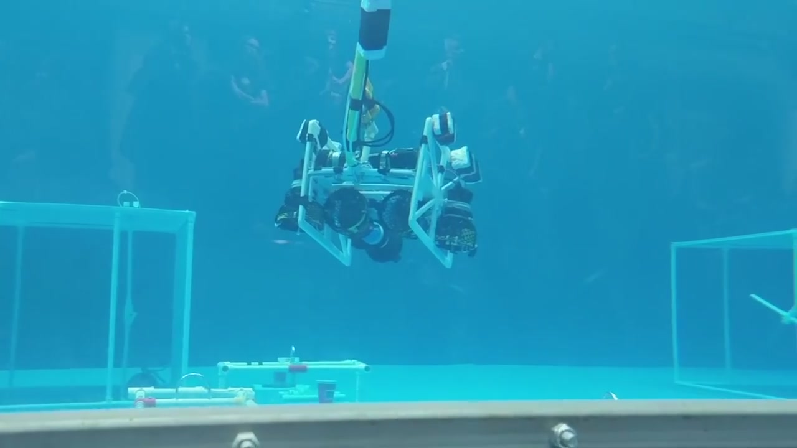

# BadBuoy

Software to pilot a ROV used in the MATE 2017 ranger competition for Prince of Wales Collegiate

NOTE: If your looking for the software used to control the ROV for 2016 go to [https://github.com/jackharrhy/bitbot](https://github.com/jackharrhy/bitbot)

## Image of the ROV

## Components

* controller.py = Backend for the remote control and web server
* index.html = Frontend website layout
* static/main.css = Frontend styling
* static/main.js = Frontend code to collect data from the webserver and display it on screen
* static/vendor/* = Files used for the frontend

## Tools

* [Phidget python libraries](https://www.phidgets.com/docs/Language_-_Python)
* [Phidget motor controllers](https://www.phidgets.com/?tier=3&catid=18&pcid=15&prodid=62)
* [Tornado - Python web framework and asynchronous networking library](http://www.tornadoweb.org/en/stable/)
* [Pygame - Python game library](https://www.pygame.org/)
* [Three.js - JavaScript 3D library](https://threejs.org/)
* [THREEx - Game Extensions for Three.js](http://www.threejsgames.com/extensions/)

## License

MIT